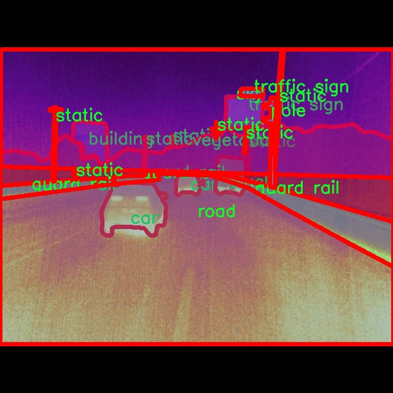

# 城市交通场景分割系统源码＆数据集分享
 [yolov8-seg-C2f-Faster＆yolov8-seg-GhostHGNetV2等50+全套改进创新点发刊_一键训练教程_Web前端展示]

### 1.研究背景与意义

项目参考[ILSVRC ImageNet Large Scale Visual Recognition Challenge](https://gitee.com/YOLOv8_YOLOv11_Segmentation_Studio/projects)

项目来源[AAAI Global Al lnnovation Contest](https://kdocs.cn/l/cszuIiCKVNis)

研究背景与意义

随着城市化进程的加速，城市交通问题日益凸显，交通拥堵、事故频发以及环境污染等问题严重影响了城市的可持续发展。因此，如何有效地管理和优化城市交通系统，成为了城市规划与管理者亟待解决的关键问题。在这一背景下，计算机视觉技术的快速发展为城市交通场景的智能化管理提供了新的解决方案。尤其是基于深度学习的目标检测与分割技术，能够在复杂的交通环境中实现对各类交通参与者的精准识别与分割，从而为交通流量分析、事故预警及城市交通规划提供重要的数据支持。

YOLO（You Only Look Once）系列模型作为一种高效的目标检测算法，因其在实时性和准确性上的优越表现，广泛应用于交通场景的分析与研究。YOLOv8作为该系列的最新版本，进一步提升了检测精度和速度，具备了更强的特征提取能力和更好的泛化性能。然而，尽管YOLOv8在目标检测领域表现出色，但在复杂的城市交通场景中，仍然面临着诸如遮挡、光照变化及多目标相互干扰等挑战。因此，基于YOLOv8的改进研究显得尤为重要，旨在提升其在城市交通场景下的分割性能，以满足实际应用需求。

本研究将基于改进的YOLOv8模型，构建一个城市交通场景分割系统，重点关注对交通环境中多类目标的精准分割。为此，我们将使用包含2000张图像的“car_train4”数据集，该数据集涵盖了21个类别，包括桥梁、建筑、车辆、行人、交通标志等多种交通元素。这些类别的多样性和复杂性为模型的训练与评估提供了丰富的样本，能够有效提升模型在实际交通场景中的适应性和鲁棒性。

通过对数据集的深入分析，我们将探索不同类别之间的特征差异，优化模型的特征提取与分类策略。此外，研究还将重点考虑实例分割技术在交通场景中的应用，旨在实现对同一类别中不同实例的精确分割。这不仅有助于提高交通参与者的识别精度，也为后续的交通流量分析、行为预测等研究提供了基础数据支持。

本研究的意义在于，通过改进YOLOv8模型，提升城市交通场景的分割精度，进而为智能交通系统的构建提供技术支持。随着智能交通技术的不断发展，基于视觉的交通管理系统将成为未来城市交通管理的重要组成部分。通过实现对交通场景的精准分割与分析，我们能够更好地理解交通流动规律，优化交通信号控制，减少交通事故，提高城市交通的整体效率与安全性。因此，本研究不仅具有重要的学术价值，也为实际的城市交通管理提供了切实可行的解决方案。

### 2.图片演示


##### 注意：由于此博客编辑较早，上面“2.图片演示”和“3.视频演示”展示的系统图片或者视频可能为老版本，新版本在老版本的基础上升级如下：（实际效果以升级的新版本为准）

  （1）适配了YOLOV8的“目标检测”模型和“实例分割”模型，通过加载相应的权重（.pt）文件即可自适应加载模型。

  （2）支持“图片识别”、“视频识别”、“摄像头实时识别”三种识别模式。

  （3）支持“图片识别”、“视频识别”、“摄像头实时识别”三种识别结果保存导出，解决手动导出（容易卡顿出现爆内存）存在的问题，识别完自动保存结果并导出到tempDir中。

  （4）支持Web前端系统中的标题、背景图等自定义修改，后面提供修改教程。

  另外本项目提供训练的数据集和训练教程,暂不提供权重文件（best.pt）,需要您按照教程进行训练后实现图片演示和Web前端界面演示的效果。

### 3.视频演示

[3.1 视频演示](https://www.bilibili.com/video/BV1WT2nYQEhP/)

### 4.数据集信息展示

##### 4.1 本项目数据集详细数据（类别数＆类别名）

nc: 21
names: ['bridge', 'building', 'car', 'car group', 'dynamic', 'fence', 'ground', 'guard rail', 'person', 'pole', 'pole group', 'road', 'sky', 'static', 'terrain', 'traffic light', 'traffic sign', 'truck', 'tunnel', 'vegetation', 'wall']


##### 4.2 本项目数据集信息介绍

数据集信息展示

在城市交通场景分割系统的研究中，数据集的选择和构建至关重要。本项目所使用的数据集名为“car_train4”，它专门为改进YOLOv8-seg模型而设计，旨在提升城市交通环境中物体的分割精度与效率。该数据集包含21个类别，涵盖了城市交通场景中常见的各种元素，为模型的训练提供了丰富的标注信息。

“car_train4”数据集的类别包括：桥梁（bridge）、建筑物（building）、汽车（car）、汽车组（car group）、动态物体（dynamic）、围栏（fence）、地面（ground）、护栏（guard rail）、行人（person）、电线杆（pole）、电线杆组（pole group）、道路（road）、天空（sky）、静态物体（static）、地形（terrain）、交通灯（traffic light）、交通标志（traffic sign）、卡车（truck）、隧道（tunnel）、植被（vegetation）以及墙壁（wall）。这些类别的选择不仅反映了城市交通场景的复杂性，也为模型的多样性和适应性提供了基础。

在数据集的构建过程中，研究团队精心收集了来自不同城市和不同天气条件下的图像，以确保数据的多样性和代表性。每个类别的样本数量经过精确计算，以保证在训练过程中模型能够接触到足够的样本，从而提高其泛化能力。例如，汽车和行人是城市交通中最常见的元素，因此在数据集中占据了较大的比例，而桥梁、隧道等相对较少见的元素则通过多样化的场景展示来增强模型的识别能力。

数据集中的每一张图像都经过精确的标注，确保每个类别的物体都能被准确识别和分割。这种细致的标注工作不仅提高了数据集的质量，也为后续的模型训练提供了坚实的基础。通过使用高质量的标注数据，YOLOv8-seg模型能够更好地学习到不同类别之间的特征差异，从而在实际应用中实现更高的分割精度。

此外，数据集还考虑到了不同的光照和天气条件对物体识别的影响。通过在不同的环境下收集数据，研究团队确保模型在各种实际应用场景中都能保持良好的性能。这种多样性使得“car_train4”数据集不仅适用于城市交通场景的分割任务，也为未来的研究提供了更多的可能性。

总之，“car_train4”数据集的构建充分考虑了城市交通场景的复杂性和多样性，为改进YOLOv8-seg模型提供了丰富的训练素材。通过精确的标注和多样化的样本选择，该数据集将为城市交通场景的智能分析和自动化处理奠定坚实的基础，推动相关领域的研究与应用向前发展。




### 5.全套项目环境部署视频教程（零基础手把手教学）

[5.1 环境部署教程链接（零基础手把手教学）](https://www.bilibili.com/video/BV1jG4Ve4E9t/?vd_source=bc9aec86d164b67a7004b996143742dc)


[5.2 安装Python虚拟环境创建和依赖库安装视频教程链接（零基础手把手教学）](https://www.bilibili.com/video/BV1nA4VeYEze/?vd_source=bc9aec86d164b67a7004b996143742dc)

### 6.手把手YOLOV8-seg训练视频教程（零基础小白有手就能学会）

[6.1 手把手YOLOV8-seg训练视频教程（零基础小白有手就能学会）](https://www.bilibili.com/video/BV1cA4VeYETe/?vd_source=bc9aec86d164b67a7004b996143742dc)


按照上面的训练视频教程链接加载项目提供的数据集，运行train.py即可开始训练



     Epoch   gpu_mem       box       obj       cls    labels  img_size
     1/200     0G   0.01576   0.01955  0.007536        22      1280: 100%|██████████| 849/849 [14:42<00:00,  1.04s/it]
               Class     Images     Labels          P          R     mAP@.5 mAP@.5:.95: 100%|██████████| 213/213 [01:14<00:00,  2.87it/s]
                 all       3395      17314      0.994      0.957      0.0957      0.0843

     Epoch   gpu_mem       box       obj       cls    labels  img_size
     2/200     0G   0.01578   0.01923  0.007006        22      1280: 100%|██████████| 849/849 [14:44<00:00,  1.04s/it]
               Class     Images     Labels          P          R     mAP@.5 mAP@.5:.95: 100%|██████████| 213/213 [01:12<00:00,  2.95it/s]
                 all       3395      17314      0.996      0.956      0.0957      0.0845

     Epoch   gpu_mem       box       obj       cls    labels  img_size
     3/200     0G   0.01561    0.0191  0.006895        27      1280: 100%|██████████| 849/849 [10:56<00:00,  1.29it/s]
               Class     Images     Labels          P          R     mAP@.5 mAP@.5:.95: 100%|███████   | 187/213 [00:52<00:00,  4.04it/s]
                 all       3395      17314      0.996      0.957      0.0957      0.0845


### 7.50+种全套YOLOV8-seg创新点代码加载调参视频教程（一键加载写好的改进模型的配置文件）

[7.1 50+种全套YOLOV8-seg创新点代码加载调参视频教程（一键加载写好的改进模型的配置文件）](https://www.bilibili.com/video/BV1Hw4VePEXv/?vd_source=bc9aec86d164b67a7004b996143742dc)

### 8.YOLOV8-seg图像分割算法原理

原始YOLOV8-seg算法原理

YOLOv8-seg算法是YOLO系列的最新进展，标志着目标检测和实例分割领域的一个重要里程碑。自2023年发布以来，YOLOv8-seg不仅在精度和速度上超越了前代模型，还在架构设计上进行了多项创新，使得模型在多种应用场景中表现出色。YOLOv8-seg的设计理念围绕着高效性、灵活性和可扩展性展开，旨在为研究人员和开发者提供一个强大的工具，以便于在不同的计算平台上进行训练和部署。

YOLOv8-seg的网络结构主要分为三个部分：Backbone、Neck和Head。Backbone负责特征提取，Neck负责特征融合，而Head则进行最终的目标检测和分类。该算法采用了一系列先进的技术和模块，以提升模型的性能和效率。

在Backbone部分，YOLOv8-seg引入了C2模块作为基本构成单元，结合了卷积和反卷积层，利用残差连接和瓶颈结构来减小网络的复杂度，同时提高特征提取的能力。具体而言，Backbone由5个CBS模块、4个C2f模块和1个快速空间金字塔池化(SPPF)模块组成。C2f模块的引入，替代了YOLOv5中的C3模块，增强了特征提取的灵活性和多样性。这种设计不仅提升了模型的计算速度，还提高了对小目标的检测能力，尤其是在高分辨率图像中。

Neck部分采用了PAN-FPN（路径聚合网络-特征金字塔网络）结构，旨在实现多尺度特征的有效融合。通过将来自Backbone不同阶段的特征图进行融合，Neck能够更好地捕捉不同尺度目标的信息，从而提高了目标检测的性能和鲁棒性。这种多尺度特征融合技术在YOLOv8-seg中得到了充分应用，使得模型在处理复杂场景时，能够更好地应对目标的多样性和变形。

在Head部分，YOLOv8-seg的设计也进行了重要的创新。与之前的YOLO系列模型不同，YOLOv8-seg采用了Anchor-Free的检测方式，简化了目标检测的过程。检测头由三个独立的检测模块组成，分别用于处理不同尺寸的信息。每个检测头内部包含一系列卷积层和反卷积层，负责生成最终的检测结果。这种解耦头结构的引入，使得模型在处理目标时能够更加灵活，避免了传统Anchor-Based方法中存在的许多限制。

此外，YOLOv8-seg在损失函数的设计上也进行了创新，采用了CloU损失函数，旨在提升模型的训练效率和检测精度。通过优化损失函数，YOLOv8-seg能够更好地适应不同的目标检测任务，尤其是在复杂背景下的实例分割任务中，表现出色。

值得一提的是，YOLOv8-seg的多种网络结构版本（如YOLOv8n、YOLOv8s、YOLOv8m、YOLOv8l和YOLOv8x）为用户提供了灵活的选择，用户可以根据具体的应用需求和计算资源，选择合适的模型版本。这种灵活性使得YOLOv8-seg在实际应用中具有广泛的适用性，能够满足从边缘设备到高性能计算平台的各种需求。

总的来说，YOLOv8-seg算法通过对Backbone、Neck和Head的精心设计，结合多项创新技术，极大地提升了目标检测和实例分割的性能。其在精度、速度和灵活性上的优势，使得YOLOv8-seg成为计算机视觉领域中的一项重要工具，为未来的研究和应用提供了广阔的前景。随着YOLOv8-seg的不断发展和完善，我们有理由相信，它将在更多的实际场景中发挥重要作用，推动目标检测和实例分割技术的进一步进步。


### 9.系统功能展示（检测对象为举例，实际内容以本项目数据集为准）

图9.1.系统支持检测结果表格显示

  图9.2.系统支持置信度和IOU阈值手动调节

  图9.3.系统支持自定义加载权重文件best.pt(需要你通过步骤5中训练获得)

  图9.4.系统支持摄像头实时识别

  图9.5.系统支持图片识别

  图9.6.系统支持视频识别

  图9.7.系统支持识别结果文件自动保存

  图9.8.系统支持Excel导出检测结果数据


### 10.50+种全套YOLOV8-seg创新点原理讲解（非科班也可以轻松写刊发刊，V11版本正在科研待更新）

#### 10.1 由于篇幅限制，每个创新点的具体原理讲解就不一一展开，具体见下列网址中的创新点对应子项目的技术原理博客网址【Blog】：


[10.1 50+种全套YOLOV8-seg创新点原理讲解链接](https://gitee.com/qunmasj/good)

#### 10.2 部分改进模块原理讲解(完整的改进原理见上图和技术博客链接)【此小节的图要是加载失败请移步原始博客查看，链接：https://blog.csdn.net/cheng2333333?type=blog】
### CBAM空间注意力机制
近年来，随着深度学习研究方向的火热，注意力机制也被广泛地应用在图像识别、语音识别和自然语言处理等领域，注意力机制在深度学习任务中发挥着举足轻重的作用。注意力机制借鉴于人类的视觉系统，例如，人眼在看到一幅画面时，会倾向于关注画面中的重要信息，而忽略其他可见的信息。深度学习中的注意力机制和人类视觉的注意力机制相似，通过扫描全局数据，从大量数据中选择出需要重点关注的、对当前任务更为重要的信息，然后对这部分信息分配更多的注意力资源，从这些信息中获取更多所需要的细节信息，而抑制其他无用的信息。而在深度学习中，则具体表现为给感兴趣的区域更高的权重，经过网络的学习和调整，得到最优的权重分配，形成网络模型的注意力，使网络拥有更强的学习能力，加快网络的收敛速度。
注意力机制通常可分为软注意力机制和硬注意力机制[4-5]。软注意力机制在选择信息时，不是从输入的信息中只选择1个，而会用到所有输入信息，只是各个信息对应的权重分配不同，然后输入网络模型进行计算;硬注意力机制则是从输入的信息中随机选取一个或者选择概率最高的信息，但是这一步骤通常是不可微的，导致硬注意力机制更难训练。因此，软注意力机制应用更为广泛，按照原理可将软注意力机制划分为:通道注意力机制（channel attention)、空间注意力机制(spatial attention）和混合域注意力机制(mixed attention)。
通道注意力机制的本质建立各个特征通道之间的重要程度，对感兴趣的通道进行重点关注，弱化不感兴趣的通道的作用;空间注意力的本质则是建模了整个空间信息的重要程度，然后对空间内感兴趣的区域进行重点关注，弱化其余非感兴趣区域的作用;混合注意力同时运用了通道注意力和空间注意力，两部分先后进行或并行，形成对通道特征和空间特征同时关注的注意力模型。

卷积层注意力模块(Convolutional Block Attention Module，CBAM）是比较常用的混合注意力模块，其先后集中了通道注意力模块和空间注意力模块，网络中加入该模块能有效提高网络性能，减少网络模型的计算量，模块结构如图所示。输入特征图首先经过分支的通道注意力模块，然后和主干的原特征图融合，得到具有通道注意力的特征图，接着经过分支的空间注意力模块，在和主干的特征图融合后，得到同时具有通道特征注意力和空间特征注意力的特征图。CBAM模块不改变输入特征图的大小，因此该模块是一个“即插即用”的模块，可以插入网络的任何位置。

通道注意力模块的结构示意图如图所示，通道注意力模块分支并行地对输入的特征图进行最大池化操作和平均池化操作，然后利用多层感知机对结果进行变换，得到应用于两个通道的变换结果，最后经过sigmoid激活函数将变换结果融合，得到具有通道注意力的通道特征图。

空间注意力模块示意图如图所示，将通道注意力模块输出的特征图作为该模块的输入特征图，首先对输入特征图进行基于通道的最大池化操作和平均池化操作，将两部分得到的结果拼接起来，然后通过卷积得到降为Ⅰ通道的特征图，最后通过sigmoid激活函数生成具有空间注意力的特征图。


### 11.项目核心源码讲解（再也不用担心看不懂代码逻辑）

#### 11.1 ui.py

以下是对给定代码的核心部分进行提炼和详细注释的版本：

```python
import sys
import subprocess

def run_script(script_path):
    """
    使用当前 Python 环境运行指定的脚本。

    Args:
        script_path (str): 要运行的脚本路径

    Returns:
        None
    """
    # 获取当前 Python 解释器的路径
    python_path = sys.executable

    # 构建运行命令，使用 streamlit 运行指定的脚本
    command = f'"{python_path}" -m streamlit run "{script_path}"'

    # 执行命令并等待其完成
    result = subprocess.run(command, shell=True)
    
    # 检查命令执行结果，如果返回码不为0，则表示出错
    if result.returncode != 0:
        print("脚本运行出错。")

# 主程序入口
if __name__ == "__main__":
    # 指定要运行的脚本路径
    script_path = "web.py"  # 这里可以直接指定脚本名称

    # 调用函数运行脚本
    run_script(script_path)
```

### 代码核心部分分析与注释：

1. **导入模块**：
   - `import sys`: 导入 `sys` 模块以获取当前 Python 解释器的路径。
   - `import subprocess`: 导入 `subprocess` 模块以便在 Python 中执行外部命令。

2. **定义 `run_script` 函数**：
   - 该函数接收一个脚本路径作为参数，并使用当前 Python 环境运行该脚本。
   - `python_path = sys.executable`: 获取当前 Python 解释器的完整路径。
   - `command = f'"{python_path}" -m streamlit run "{script_path}"'`: 构建要执行的命令，使用 `streamlit` 模块运行指定的脚本。
   - `result = subprocess.run(command, shell=True)`: 执行构建的命令，并等待其完成。
   - `if result.returncode != 0`: 检查命令的返回码，如果不为0，表示脚本运行出错，打印错误信息。

3. **主程序入口**：
   - `if __name__ == "__main__":`：确保只有在直接运行该脚本时才会执行以下代码。
   - `script_path = "web.py"`: 指定要运行的脚本名称，可以根据需要修改。
   - `run_script(script_path)`: 调用 `run_script` 函数，传入脚本路径以执行。

通过这些注释，代码的功能和每个部分的作用变得更加清晰。

这个程序文件名为 `ui.py`，它的主要功能是通过当前的 Python 环境来运行一个指定的脚本，具体是使用 Streamlit 框架来启动一个 Web 应用。

首先，文件导入了几个必要的模块，包括 `sys`、`os` 和 `subprocess`。其中，`sys` 模块用于访问与 Python 解释器相关的变量和函数，`os` 模块提供了与操作系统交互的功能，而 `subprocess` 模块则用于执行外部命令。

接下来，程序定义了一个名为 `run_script` 的函数，该函数接受一个参数 `script_path`，表示要运行的脚本的路径。在函数内部，首先通过 `sys.executable` 获取当前 Python 解释器的路径，这样可以确保使用正确的 Python 环境来运行脚本。然后，构建一个命令字符串，该命令使用 Streamlit 运行指定的脚本。命令的格式是 `"{python_path}" -m streamlit run "{script_path}"`，其中 `python_path` 是 Python 解释器的路径，`script_path` 是要运行的脚本路径。

接着，使用 `subprocess.run` 方法来执行构建好的命令。这个方法会在新的进程中运行命令，并等待其完成。如果命令执行后返回的状态码不为 0，表示脚本运行出错，程序会打印出相应的错误信息。

在文件的最后部分，使用 `if __name__ == "__main__":` 语句来确保只有在直接运行该脚本时才会执行后面的代码。这里指定了要运行的脚本路径 `script_path`，并调用 `run_script` 函数来启动这个脚本。

总的来说，这个文件的功能是为用户提供一个简单的接口，以便在当前 Python 环境中启动一个 Streamlit Web 应用，具体的应用逻辑则在 `web.py` 文件中实现。

#### 11.2 ultralytics\utils\callbacks\neptune.py

以下是经过简化和注释的核心代码部分：

```python
# 导入必要的库
from ultralytics.utils import LOGGER, SETTINGS, TESTS_RUNNING

# 尝试导入NeptuneAI库并进行初始化
try:
    assert not TESTS_RUNNING  # 确保不是在测试运行中
    assert SETTINGS['neptune'] is True  # 确保Neptune集成已启用
    import neptune
    from neptune.types import File

    assert hasattr(neptune, '__version__')  # 确保Neptune库版本存在

    run = None  # NeptuneAI实验记录实例

except (ImportError, AssertionError):
    neptune = None  # 如果导入失败，则将neptune设置为None


def _log_scalars(scalars, step=0):
    """将标量数据记录到NeptuneAI实验记录器中。"""
    if run:  # 如果Neptune实例存在
        for k, v in scalars.items():  # 遍历标量字典
            run[k].append(value=v, step=step)  # 记录标量值和步骤


def _log_images(imgs_dict, group=''):
    """将图像记录到NeptuneAI实验记录器中。"""
    if run:  # 如果Neptune实例存在
        for k, v in imgs_dict.items():  # 遍历图像字典
            run[f'{group}/{k}'].upload(File(v))  # 上传图像文件


def on_pretrain_routine_start(trainer):
    """在训练例程开始前调用的回调函数。"""
    try:
        global run
        # 初始化Neptune运行
        run = neptune.init_run(project=trainer.args.project or 'YOLOv8', name=trainer.args.name, tags=['YOLOv8'])
        # 记录超参数配置
        run['Configuration/Hyperparameters'] = {k: '' if v is None else v for k, v in vars(trainer.args).items()}
    except Exception as e:
        LOGGER.warning(f'WARNING ⚠️ NeptuneAI安装但未正确初始化，未记录此运行。 {e}')


def on_train_epoch_end(trainer):
    """每个训练周期结束时调用的回调函数。"""
    _log_scalars(trainer.label_loss_items(trainer.tloss, prefix='train'), trainer.epoch + 1)  # 记录训练损失
    _log_scalars(trainer.lr, trainer.epoch + 1)  # 记录学习率
    if trainer.epoch == 1:  # 如果是第一个周期
        # 记录训练批次的图像
        _log_images({f.stem: str(f) for f in trainer.save_dir.glob('train_batch*.jpg')}, 'Mosaic')


def on_train_end(trainer):
    """训练结束时调用的回调函数。"""
    if run:  # 如果Neptune实例存在
        # 记录最终结果和模型
        files = [
            'results.png', 'confusion_matrix.png', 'confusion_matrix_normalized.png',
            *(f'{x}_curve.png' for x in ('F1', 'PR', 'P', 'R'))]
        files = [(trainer.save_dir / f) for f in files if (trainer.save_dir / f).exists()]  # 过滤存在的文件
        for f in files:
            _log_plot(title=f.stem, plot_path=f)  # 记录图表
        # 记录最终模型
        run[f'weights/{trainer.args.name or trainer.args.task}/{str(trainer.best.name)}'].upload(File(str(trainer.best)))


# 定义回调函数字典
callbacks = {
    'on_pretrain_routine_start': on_pretrain_routine_start,
    'on_train_epoch_end': on_train_epoch_end,
    'on_train_end': on_train_end} if neptune else {}
```

### 代码说明：
1. **导入和初始化**：首先导入必要的库，并尝试初始化NeptuneAI。如果初始化失败，则将`neptune`设置为`None`。
2. **记录标量**：`_log_scalars`函数用于将标量数据（如损失和学习率）记录到Neptune。
3. **记录图像**：`_log_images`函数用于将图像上传到Neptune，方便可视化。
4. **训练开始回调**：`on_pretrain_routine_start`函数在训练开始前被调用，初始化Neptune运行并记录超参数。
5. **训练周期结束回调**：`on_train_epoch_end`函数在每个训练周期结束时被调用，记录损失和学习率，并在第一个周期结束时记录训练图像。
6. **训练结束回调**：`on_train_end`函数在训练结束时被调用，记录最终结果和模型权重。

这些核心部分提供了训练过程中的关键数据记录功能，便于后续分析和可视化。

这个程序文件是一个用于与NeptuneAI集成的回调函数模块，主要用于在训练YOLO模型时记录实验数据。文件首先导入了一些必要的模块和库，并尝试初始化NeptuneAI的实验记录器。如果在导入过程中出现错误（如未安装Neptune或未正确配置），则将`neptune`设置为`None`，以避免后续代码出现问题。

在文件中定义了一些私有函数，用于记录不同类型的数据。`_log_scalars`函数用于记录标量数据，比如损失值和学习率；`_log_images`函数用于记录图像数据，支持将训练过程中的图像上传到Neptune；`_log_plot`函数用于记录绘图数据，它会读取指定路径的图像文件并上传。

接下来，定义了一些回调函数，这些函数会在特定的训练阶段被调用。`on_pretrain_routine_start`函数在训练开始前被调用，负责初始化Neptune的运行实例并记录超参数配置；`on_train_epoch_end`函数在每个训练周期结束时被调用，记录训练损失和学习率，并在第一轮结束时上传训练批次的图像；`on_fit_epoch_end`函数在每个训练和验证周期结束时被调用，记录模型的相关信息和指标；`on_val_end`函数在验证结束时被调用，记录验证集的图像；`on_train_end`函数在训练结束时被调用，记录最终的结果和模型权重。

最后，文件将这些回调函数以字典的形式存储，方便在训练过程中根据需要调用。如果Neptune未初始化，则该字典为空。整体来看，这个模块的主要功能是帮助用户在训练YOLO模型时，方便地记录和可视化训练过程中的各种信息，以便后续分析和调试。

#### 11.3 ui_style.py

以下是提取后的核心代码部分，并附上详细的中文注释：

```python
import base64  # 导入base64模块，用于进行Base64编码
import streamlit as st  # 导入Streamlit库，用于构建Web应用

# 读取图片并转换为 Base64
def get_base64_of_bin_file(bin_file):
    # 以二进制模式打开文件
    with open(bin_file, 'rb') as file:
        data = file.read()  # 读取文件内容
    # 将读取的二进制数据进行Base64编码，并返回字符串格式
    return base64.b64encode(data).decode()

# 定义CSS样式
def def_css_hitml():
    # 使用Streamlit的markdown功能注入自定义CSS样式
    st.markdown("""
        <style>
        /* 全局样式 */
        .css-2trqyj, .css-1d391kg, .st-bb, .st-at {
            font-family: 'Gill Sans', 'Gill Sans MT', Calibri, 'Trebuchet MS', sans-serif;  /* 设置字体 */
            background-color: #cadefc;  /* 设置背景颜色 */
            color: #21618C;  /* 设置字体颜色 */
        }

        /* 按钮样式 */
        .stButton > button {
            border: none;  /* 去掉按钮边框 */
            color: white;  /* 设置按钮文字颜色 */
            padding: 10px 20px;  /* 设置按钮内边距 */
            text-align: center;  /* 设置文字居中 */
            text-decoration: none;  /* 去掉文字下划线 */
            display: inline-block;  /* 使按钮成为块级元素 */
            font-size: 16px;  /* 设置按钮字体大小 */
            margin: 2px 1px;  /* 设置按钮外边距 */
            cursor: pointer;  /* 鼠标悬停时显示为手型 */
            border-radius: 8px;  /* 设置按钮圆角 */
            background-color: #9896f1;  /* 设置按钮背景颜色 */
            box-shadow: 0 2px 4px 0 rgba(0,0,0,0.2);  /* 设置按钮阴影效果 */
            transition-duration: 0.4s;  /* 设置按钮过渡效果时间 */
        }
        .stButton > button:hover {
            background-color: #5499C7;  /* 鼠标悬停时改变背景颜色 */
            color: white;  /* 鼠标悬停时保持文字颜色 */
            box-shadow: 0 8px 12px 0 rgba(0,0,0,0.24);  /* 鼠标悬停时改变阴影效果 */
        }

        /* 侧边栏样式 */
        .css-1lcbmhc.e1fqkh3o0 {
            background-color: #154360;  /* 设置侧边栏背景颜色 */
            color: #FDFEFE;  /* 设置侧边栏文字颜色 */
            border-right: 2px solid #DDD;  /* 设置侧边栏右边框 */
        }

        /* Radio 按钮样式 */
        .stRadio > label {
            display: inline-flex;  /* 设置为弹性盒子布局 */
            align-items: center;  /* 垂直居中对齐 */
            cursor: pointer;  /* 鼠标悬停时显示为手型 */
        }
        .stRadio > label > span:first-child {
            background-color: #FFF;  /* 设置单选按钮背景颜色 */
            border: 1px solid #CCC;  /* 设置单选按钮边框 */
            width: 1em;  /* 设置单选按钮宽度 */
            height: 1em;  /* 设置单选按钮高度 */
            border-radius: 50%;  /* 设置单选按钮为圆形 */
            margin-right: 10px;  /* 设置右边距 */
            display: inline-block;  /* 使单选按钮成为块级元素 */
        }

        /* 滑块样式 */
        .stSlider .thumb {
            background-color: #2E86C1;  /* 设置滑块的颜色 */
        }
        .stSlider .track {
            background-color: #DDD;  /* 设置滑轨的颜色 */
        }

        /* 表格样式 */
        table {
            border-collapse: collapse;  /* 合并表格边框 */
            margin: 25px 0;  /* 设置表格外边距 */
            font-size: 18px;  /* 设置表格字体大小 */
            font-family: sans-serif;  /* 设置表格字体 */
            min-width: 400px;  /* 设置表格最小宽度 */
            box-shadow: 0 5px 15px rgba(0, 0, 0, 0.2);  /* 设置表格阴影效果 */
        }
        thead tr {
            background-color: #a8d8ea;  /* 设置表头背景颜色 */
            color: #ffcef3;  /* 设置表头文字颜色 */
            text-align: left;  /* 设置表头文字左对齐 */
        }
        th, td {
            padding: 15px 18px;  /* 设置单元格内边距 */
        }
        tbody tr {
            border-bottom: 2px solid #ddd;  /* 设置表格行底部边框 */
        }
        tbody tr:nth-of-type(even) {
            background-color: #D6EAF8;  /* 设置偶数行背景颜色 */
        }
        tbody tr:last-of-type {
            border-bottom: 3px solid #5499C7;  /* 设置最后一行底部边框 */
        }
        tbody tr:hover {
            background-color: #AED6F1;  /* 鼠标悬停时改变行背景颜色 */
        }
        </style>
        """, unsafe_allow_html=True)  # 允许使用HTML和CSS
```

### 代码说明：
1. **导入模块**：导入`base64`模块用于编码，导入`streamlit`用于构建Web应用。
2. **`get_base64_of_bin_file`函数**：该函数接受一个二进制文件路径，读取文件内容并将其转换为Base64编码的字符串。
3. **`def_css_hitml`函数**：该函数定义了多个CSS样式，使用`st.markdown`将其注入到Streamlit应用中，以自定义应用的外观和感觉，包括全局样式、按钮样式、侧边栏样式、单选按钮样式、滑块样式和表格样式。

这个程序文件 `ui_style.py` 是一个用于定义和应用自定义样式的脚本，主要用于 Streamlit 应用程序的界面美化。文件中包含了几个重要的功能和样式定义。

首先，文件导入了 `base64` 和 `streamlit` 模块。`base64` 模块用于处理二进制数据的编码，而 `streamlit` 是一个用于快速构建数据应用的库。

接下来，定义了一个名为 `get_base64_of_bin_file` 的函数，该函数接收一个二进制文件的路径作为参数。它打开该文件并读取其内容，然后将读取到的二进制数据转换为 Base64 编码的字符串。这种编码方式常用于在网页中嵌入图像等媒体文件。

然后，定义了 `def_css_hitml` 函数，这个函数的主要作用是通过 Streamlit 的 `st.markdown` 方法将一段 CSS 样式嵌入到应用程序中。该 CSS 样式定义了多个界面元素的外观，包括全局样式、按钮样式、侧边栏样式、单选按钮样式、滑块样式和表格样式等。

在全局样式部分，设置了字体和背景颜色，使得整个应用程序看起来更加统一和美观。按钮样式部分则定义了按钮的边框、颜色、内边距、字体大小、边距、圆角以及悬停时的效果，使得按钮在用户交互时更具吸引力。侧边栏的样式设置了背景色和文本颜色，确保其在视觉上与主内容区区分开来。

单选按钮和滑块的样式也进行了定制，使得这些控件在视觉上更加美观和易于使用。表格样式部分则定义了表格的边框、字体、阴影效果等，使得数据展示更加清晰和易读。

总体来说，这个文件通过定义和应用 CSS 样式，提升了 Streamlit 应用程序的用户界面，使其更加美观和用户友好。

#### 11.4 ultralytics\models\rtdetr\train.py

以下是代码中最核心的部分，并附上详细的中文注释：

```python
class RTDETRTrainer(DetectionTrainer):
    """
    RT-DETR模型的训练类，继承自YOLO的DetectionTrainer类。
    该模型由百度开发，专注于实时目标检测，利用视觉变换器（Vision Transformers）实现。
    具备IoU感知查询选择和可调的推理速度等特性。
    """

    def get_model(self, cfg=None, weights=None, verbose=True):
        """
        初始化并返回一个用于目标检测任务的RT-DETR模型。

        参数:
            cfg (dict, optional): 模型配置，默认为None。
            weights (str, optional): 预训练模型权重的路径，默认为None。
            verbose (bool): 如果为True，则启用详细日志，默认为True。

        返回:
            (RTDETRDetectionModel): 初始化后的模型。
        """
        # 创建RT-DETR检测模型实例
        model = RTDETRDetectionModel(cfg, nc=self.data['nc'], verbose=verbose and RANK == -1)
        # 如果提供了权重路径，则加载预训练权重
        if weights:
            model.load(weights)
        return model

    def build_dataset(self, img_path, mode='val', batch=None):
        """
        构建并返回用于训练或验证的RT-DETR数据集。

        参数:
            img_path (str): 包含图像的文件夹路径。
            mode (str): 数据集模式，可以是'train'或'val'。
            batch (int, optional): 矩形训练的批量大小，默认为None。

        返回:
            (RTDETRDataset): 针对特定模式的数据集对象。
        """
        # 创建RT-DETR数据集实例
        return RTDETRDataset(img_path=img_path,
                             imgsz=self.args.imgsz,
                             batch_size=batch,
                             augment=mode == 'train',  # 训练模式下进行数据增强
                             hyp=self.args,
                             rect=False,
                             cache=self.args.cache or None,
                             prefix=colorstr(f'{mode}: '),  # 添加模式前缀
                             data=self.data)

    def get_validator(self):
        """
        返回适合RT-DETR模型验证的检测验证器。

        返回:
            (RTDETRValidator): 用于模型验证的验证器对象。
        """
        self.loss_names = 'giou_loss', 'cls_loss', 'l1_loss'  # 定义损失名称
        return RTDETRValidator(self.test_loader, save_dir=self.save_dir, args=copy(self.args))

    def preprocess_batch(self, batch):
        """
        预处理一批图像。将图像缩放并转换为浮点格式。

        参数:
            batch (dict): 包含一批图像、边界框和标签的字典。

        返回:
            (dict): 预处理后的批次数据。
        """
        # 调用父类的预处理方法
        batch = super().preprocess_batch(batch)
        bs = len(batch['img'])  # 批次大小
        batch_idx = batch['batch_idx']  # 批次索引
        gt_bbox, gt_class = [], []  # 初始化真实边界框和类别列表
        for i in range(bs):
            # 收集当前批次的真实边界框和类别
            gt_bbox.append(batch['bboxes'][batch_idx == i].to(batch_idx.device))
            gt_class.append(batch['cls'][batch_idx == i].to(device=batch_idx.device, dtype=torch.long))
        return batch  # 返回预处理后的批次数据
```

### 代码说明：
1. **RTDETRTrainer类**：这是一个专门用于训练RT-DETR模型的类，继承自YOLO的DetectionTrainer类，包含了模型的初始化、数据集的构建、验证器的获取和批次数据的预处理等功能。
  
2. **get_model方法**：用于创建RT-DETR模型的实例，并可选择性地加载预训练权重。

3. **build_dataset方法**：根据给定的图像路径和模式（训练或验证）构建相应的数据集。

4. **get_validator方法**：返回一个验证器对象，用于模型的验证过程。

5. **preprocess_batch方法**：对输入的图像批次进行预处理，包括缩放和格式转换，以便于后续的模型训练或推理。

这个程序文件是用于训练RT-DETR模型的，RT-DETR是百度开发的一种实时目标检测模型。该文件继承自YOLO的DetectionTrainer类，并针对RT-DETR的特性和架构进行了适配。RT-DETR模型结合了视觉变换器（Vision Transformers），并具备一些特性，比如IoU感知的查询选择和可调的推理速度。

在文件的开头，导入了一些必要的库和模块，包括PyTorch、YOLO的检测训练器、RT-DETR模型以及数据集和验证器的相关模块。

RTDETRTrainer类中定义了多个方法。首先是`get_model`方法，用于初始化并返回一个RT-DETR模型。该方法接受模型配置、预训练权重路径和是否详细记录日志的参数。如果提供了权重路径，模型会加载这些权重。

接下来是`build_dataset`方法，它用于构建并返回一个RT-DETR数据集，支持训练和验证模式。该方法接受图像路径、模式（训练或验证）和批次大小作为参数，并根据这些参数创建RTDETRDataset对象。

`get_validator`方法返回一个适合RT-DETR模型验证的检测验证器。该方法还定义了损失名称，包括giou损失、分类损失和l1损失。

最后，`preprocess_batch`方法用于预处理一批图像。它将图像缩放并转换为浮点格式。该方法会从父类调用预处理功能，并对每个图像的边界框和类别进行处理，确保它们在正确的设备上。

整个程序文件为RT-DETR模型的训练提供了一个完整的框架，包括模型的初始化、数据集的构建、验证器的获取以及批次的预处理。这些功能结合在一起，使得用户能够方便地训练和验证RT-DETR模型。

#### 11.5 ultralytics\utils\callbacks\__init__.py

以下是经过简化并添加详细中文注释的核心代码部分：

```python
# 导入必要的函数和模块
from .base import add_integration_callbacks, default_callbacks, get_default_callbacks

# 定义模块的公开接口，包含要导出的函数
__all__ = 'add_integration_callbacks', 'default_callbacks', 'get_default_callbacks'
```

### 代码注释说明：

1. `from .base import add_integration_callbacks, default_callbacks, get_default_callbacks`：
   - 这一行代码从当前包的 `base` 模块中导入了三个函数：`add_integration_callbacks`、`default_callbacks` 和 `get_default_callbacks`。这些函数可能用于处理回调函数的集成、获取默认回调等功能。

2. `__all__ = 'add_integration_callbacks', 'default_callbacks', 'get_default_callbacks'`：
   - 这一行定义了模块的公开接口。`__all__` 是一个特殊变量，用于指定当使用 `from module import *` 语句时，哪些名称会被导入。这里列出的三个函数将会被视为模块的公共 API，其他未列出的名称将不会被导入。

这个程序文件是Ultralytics YOLO项目中的一个模块，位于`ultralytics/utils/callbacks`目录下，文件名为`__init__.py`。该文件的主要功能是初始化回调函数相关的模块。

首先，文件开头的注释表明这是Ultralytics YOLO项目的一部分，并且该项目遵循AGPL-3.0许可证。这意味着该项目是开源的，用户可以自由使用和修改，但需要遵循相应的许可证条款。

接下来，文件通过`from .base import ...`语句从同一目录下的`base`模块导入了三个函数：`add_integration_callbacks`、`default_callbacks`和`get_default_callbacks`。这些函数的具体功能并没有在这个文件中定义，但可以推测它们与回调机制有关，可能用于在训练或推理过程中添加、获取或管理回调函数。

最后，`__all__`变量被定义为一个元组，包含了刚刚导入的三个函数的名称。这一做法的目的是为了控制模块的公共接口，只有在使用`from module import *`时，才会导入`__all__`中列出的名称。这有助于避免不必要的名称冲突，并使模块的使用更加清晰。

总体来说，这个`__init__.py`文件的作用是为回调函数提供一个简洁的接口，方便其他模块或用户进行调用和使用。

#### 11.6 ultralytics\utils\callbacks\base.py

以下是经过简化并添加详细中文注释的核心代码部分：

```python
# Ultralytics YOLO 🚀, AGPL-3.0 license
"""基础回调函数定义。"""

from collections import defaultdict
from copy import deepcopy

# 默认回调函数字典，包含训练、验证、预测和导出过程中的回调函数
default_callbacks = {
    # 训练过程中的回调
    'on_train_start': [lambda trainer: print("训练开始")],  # 训练开始时调用
    'on_train_epoch_end': [lambda trainer: print("训练周期结束")],  # 每个训练周期结束时调用
    'on_train_end': [lambda trainer: print("训练结束")],  # 训练结束时调用

    # 验证过程中的回调
    'on_val_start': [lambda validator: print("验证开始")],  # 验证开始时调用
    'on_val_end': [lambda validator: print("验证结束")],  # 验证结束时调用

    # 预测过程中的回调
    'on_predict_start': [lambda predictor: print("预测开始")],  # 预测开始时调用
    'on_predict_end': [lambda predictor: print("预测结束")],  # 预测结束时调用

    # 导出过程中的回调
    'on_export_start': [lambda exporter: print("导出开始")],  # 导出开始时调用
    'on_export_end': [lambda exporter: print("导出结束")]  # 导出结束时调用
}

def get_default_callbacks():
    """
    返回一个默认回调字典的副本，字典的值为默认空列表。

    返回:
        (defaultdict): 一个defaultdict，包含default_callbacks中的键和空列表作为默认值。
    """
    return defaultdict(list, deepcopy(default_callbacks))

def add_integration_callbacks(instance):
    """
    从各种来源向实例的回调中添加集成回调。

    参数:
        instance (Trainer, Predictor, Validator, Exporter): 一个具有'callbacks'属性的对象，该属性是一个回调列表的字典。
    """
    # 加载HUB回调
    from .hub import callbacks as hub_cb
    callbacks_list = [hub_cb]

    # 如果实例是Trainer类，则加载训练相关的回调
    if 'Trainer' in instance.__class__.__name__:
        from .clearml import callbacks as clear_cb
        from .comet import callbacks as comet_cb
        from .dvc import callbacks as dvc_cb
        from .mlflow import callbacks as mlflow_cb
        from .neptune import callbacks as neptune_cb
        from .raytune import callbacks as tune_cb
        from .tensorboard import callbacks as tb_cb
        from .wb import callbacks as wb_cb
        callbacks_list.extend([clear_cb, comet_cb, dvc_cb, mlflow_cb, neptune_cb, tune_cb, tb_cb, wb_cb])

    # 将加载的回调添加到实例的回调字典中
    for callbacks in callbacks_list:
        for k, v in callbacks.items():
            if v not in instance.callbacks[k]:
                instance.callbacks[k].append(v)
```

### 代码说明：
1. **default_callbacks**: 定义了一个包含训练、验证、预测和导出过程中的回调函数的字典。每个回调函数在特定事件发生时被调用。
2. **get_default_callbacks**: 该函数返回一个包含默认回调的字典副本，确保每次调用都返回一个新的字典实例。
3. **add_integration_callbacks**: 该函数用于将不同来源的回调集成到指定实例的回调字典中，支持多种训练框架的回调加载。

这个程序文件 `ultralytics/utils/callbacks/base.py` 定义了一系列用于训练、验证、预测和导出模型的回调函数。这些回调函数在不同的训练阶段被调用，以便用户可以在这些关键时刻插入自定义逻辑或操作。

文件的开头部分导入了 `defaultdict` 和 `deepcopy`，这两个模块将用于管理回调函数和处理数据结构。

接下来，文件中定义了一系列回调函数，这些函数可以分为四个主要类别：训练回调、验证回调、预测回调和导出回调。每个类别中的函数在特定的训练或验证阶段被调用。例如，`on_train_start` 函数在训练开始时被调用，而 `on_train_epoch_end` 函数在每个训练周期结束时被调用。这些函数目前的实现是空的（即 `pass`），这意味着它们可以被用户根据需要进行扩展和实现。

在训练回调部分，函数包括：
- `on_pretrain_routine_start` 和 `on_pretrain_routine_end`：在预训练例程开始和结束时调用。
- `on_train_start`：训练开始时调用。
- `on_train_epoch_start` 和 `on_train_epoch_end`：每个训练周期开始和结束时调用。
- `on_train_batch_start` 和 `on_train_batch_end`：每个训练批次开始和结束时调用。
- `optimizer_step`：优化器进行一步更新时调用。
- `on_before_zero_grad`：在梯度被置零之前调用。
- `on_model_save`：模型保存时调用。
- `on_train_end`：训练结束时调用。
- `on_params_update`：模型参数更新时调用。
- `teardown`：训练过程结束时的清理工作。

验证回调部分的函数类似，负责在验证过程的不同阶段进行调用，例如 `on_val_start` 和 `on_val_end`。

预测回调部分的函数则在进行模型预测时被调用，包括 `on_predict_start` 和 `on_predict_end`。

导出回调部分的函数用于模型导出过程，包含 `on_export_start` 和 `on_export_end`。

文件的最后部分定义了一个 `default_callbacks` 字典，其中包含了所有回调函数的映射关系，以便在需要时快速访问。

`get_default_callbacks` 函数返回一个深拷贝的 `default_callbacks` 字典，确保每次调用时都能得到一个新的字典实例，避免在使用过程中出现意外修改。

`add_integration_callbacks` 函数则用于将来自不同来源的集成回调添加到实例的回调字典中。它首先加载一些特定的回调模块（如 `hub` 模块），然后根据实例的类型（如 `Trainer`）加载相应的回调。这些回调被添加到实例的回调字典中，以便在训练或验证过程中使用。

总的来说，这个文件为 Ultralytics YOLO 提供了一个灵活的回调机制，允许用户在模型训练、验证、预测和导出过程中插入自定义逻辑，从而增强模型的功能和可扩展性。

### 12.系统整体结构（节选）

### 整体功能和构架概括

该项目是一个基于Ultralytics YOLO和RT-DETR模型的目标检测框架，旨在提供一个灵活、高效的训练和推理工具。项目的整体架构包括多个模块，涵盖了模型训练、验证、预测、回调机制以及用户界面（UI）设计等方面。通过使用回调函数，用户可以在训练和验证过程中插入自定义逻辑，增强模型的功能。此外，项目还提供了友好的用户界面和样式定义，以便于用户进行交互和可视化。

### 文件功能整理表

| 文件路径                                         | 功能描述                                                         |
|--------------------------------------------------|------------------------------------------------------------------|
| `C:\codeseg\codenew\code\ui.py`                 | 启动Streamlit Web应用，提供用户界面以运行指定的脚本。           |
| `C:\codeseg\codenew\code\ultralytics\utils\callbacks\neptune.py` | 集成NeptuneAI，用于记录训练过程中的实验数据和指标。            |
| `C:\codeseg\codenew\code\ui_style.py`          | 定义和应用Streamlit应用的自定义CSS样式，提升用户界面美观性。   |
| `C:\codeseg\codenew\code\ultralytics\models\rtdetr\train.py` | 实现RT-DETR模型的训练逻辑，包括模型初始化、数据集构建等。     |
| `C:\codeseg\codenew\code\ultralytics\utils\callbacks\__init__.py` | 初始化回调函数模块，提供公共接口以便于其他模块调用。            |
| `C:\codeseg\codenew\code\ultralytics\utils\callbacks\base.py` | 定义训练、验证、预测和导出过程中的回调函数，支持用户自定义逻辑。 |
| `C:\codeseg\codenew\code\ultralytics\utils\callbacks\comet.py` | 集成Comet.ml，用于记录和可视化实验数据。                       |
| `C:\codeseg\codenew\code\ultralytics\utils\callbacks\raytune.py` | 集成Ray Tune，用于超参数调优和实验管理。                       |
| `C:\codeseg\codenew\code\ultralytics\models\yolo\segment\__init__.py` | 初始化YOLO分割模型模块，提供相关功能和接口。                   |
| `C:\codeseg\codenew\code\ultralytics\utils\callbacks\wb.py` | 集成Weights & Biases，用于实验跟踪和可视化。                   |
| `C:\codeseg\codenew\code\ultralytics\models\yolo\pose\predict.py` | 实现YOLO姿态估计模型的预测逻辑。                               |
| `C:\codeseg\codenew\code\ultralytics\models\yolo\detect\__init__.py` | 初始化YOLO检测模型模块，提供相关功能和接口。                   |
| `C:\codeseg\codenew\code\train.py`              | 主要训练脚本，负责启动模型训练过程，配置参数和数据集等。       |

这个表格概述了项目中各个文件的主要功能，帮助理解项目的整体结构和各个模块之间的关系。

注意：由于此博客编辑较早，上面“11.项目核心源码讲解（再也不用担心看不懂代码逻辑）”中部分代码可能会优化升级，仅供参考学习，完整“训练源码”、“Web前端界面”和“50+种创新点源码”以“14.完整训练+Web前端界面+50+种创新点源码、数据集获取”的内容为准。

### 13.图片、视频、摄像头图像分割Demo(去除WebUI)代码

在这个博客小节中，我们将讨论如何在不使用WebUI的情况下，实现图像分割模型的使用。本项目代码已经优化整合，方便用户将分割功能嵌入自己的项目中。
核心功能包括图片、视频、摄像头图像的分割，ROI区域的轮廓提取、类别分类、周长计算、面积计算、圆度计算以及颜色提取等。
这些功能提供了良好的二次开发基础。

### 核心代码解读

以下是主要代码片段，我们会为每一块代码进行详细的批注解释：

```python
import random
import cv2
import numpy as np
from PIL import ImageFont, ImageDraw, Image
from hashlib import md5
from model import Web_Detector
from chinese_name_list import Label_list

# 根据名称生成颜色
def generate_color_based_on_name(name):
    ......

# 计算多边形面积
def calculate_polygon_area(points):
    return cv2.contourArea(points.astype(np.float32))

...
# 绘制中文标签
def draw_with_chinese(image, text, position, font_size=20, color=(255, 0, 0)):
    image_pil = Image.fromarray(cv2.cvtColor(image, cv2.COLOR_BGR2RGB))
    draw = ImageDraw.Draw(image_pil)
    font = ImageFont.truetype("simsun.ttc", font_size, encoding="unic")
    draw.text(position, text, font=font, fill=color)
    return cv2.cvtColor(np.array(image_pil), cv2.COLOR_RGB2BGR)

# 动态调整参数
def adjust_parameter(image_size, base_size=1000):
    max_size = max(image_size)
    return max_size / base_size

# 绘制检测结果
def draw_detections(image, info, alpha=0.2):
    name, bbox, conf, cls_id, mask = info['class_name'], info['bbox'], info['score'], info['class_id'], info['mask']
    adjust_param = adjust_parameter(image.shape[:2])
    spacing = int(20 * adjust_param)

    if mask is None:
        x1, y1, x2, y2 = bbox
        aim_frame_area = (x2 - x1) * (y2 - y1)
        cv2.rectangle(image, (x1, y1), (x2, y2), color=(0, 0, 255), thickness=int(3 * adjust_param))
        image = draw_with_chinese(image, name, (x1, y1 - int(30 * adjust_param)), font_size=int(35 * adjust_param))
        y_offset = int(50 * adjust_param)  # 类别名称上方绘制，其下方留出空间
    else:
        mask_points = np.concatenate(mask)
        aim_frame_area = calculate_polygon_area(mask_points)
        mask_color = generate_color_based_on_name(name)
        try:
            overlay = image.copy()
            cv2.fillPoly(overlay, [mask_points.astype(np.int32)], mask_color)
            image = cv2.addWeighted(overlay, 0.3, image, 0.7, 0)
            cv2.drawContours(image, [mask_points.astype(np.int32)], -1, (0, 0, 255), thickness=int(8 * adjust_param))

            # 计算面积、周长、圆度
            area = cv2.contourArea(mask_points.astype(np.int32))
            perimeter = cv2.arcLength(mask_points.astype(np.int32), True)
            ......

            # 计算色彩
            mask = np.zeros(image.shape[:2], dtype=np.uint8)
            cv2.drawContours(mask, [mask_points.astype(np.int32)], -1, 255, -1)
            color_points = cv2.findNonZero(mask)
            ......

            # 绘制类别名称
            x, y = np.min(mask_points, axis=0).astype(int)
            image = draw_with_chinese(image, name, (x, y - int(30 * adjust_param)), font_size=int(35 * adjust_param))
            y_offset = int(50 * adjust_param)

            # 绘制面积、周长、圆度和色彩值
            metrics = [("Area", area), ("Perimeter", perimeter), ("Circularity", circularity), ("Color", color_str)]
            for idx, (metric_name, metric_value) in enumerate(metrics):
                ......

    return image, aim_frame_area

# 处理每帧图像
def process_frame(model, image):
    pre_img = model.preprocess(image)
    pred = model.predict(pre_img)
    det = pred[0] if det is not None and len(det)
    if det:
        det_info = model.postprocess(pred)
        for info in det_info:
            image, _ = draw_detections(image, info)
    return image

if __name__ == "__main__":
    cls_name = Label_list
    model = Web_Detector()
    model.load_model("./weights/yolov8s-seg.pt")

    # 摄像头实时处理
    cap = cv2.VideoCapture(0)
    while cap.isOpened():
        ret, frame = cap.read()
        if not ret:
            break
        ......

    # 图片处理
    image_path = './icon/OIP.jpg'
    image = cv2.imread(image_path)
    if image is not None:
        processed_image = process_frame(model, image)
        ......

    # 视频处理
    video_path = ''  # 输入视频的路径
    cap = cv2.VideoCapture(video_path)
    while cap.isOpened():
        ret, frame = cap.read()
        ......
```


### 14.完整训练+Web前端界面+50+种创新点源码、数据集获取


# [下载链接：https://mbd.pub/o/bread/ZpyXlZdv](https://mbd.pub/o/bread/ZpyXlZdv)